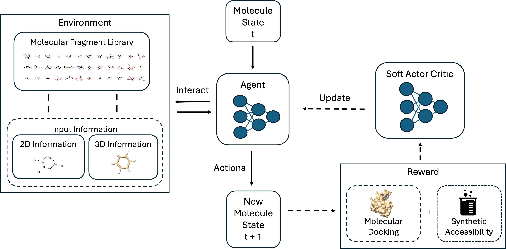

# Statistical Machine Learning Framework for De Novo Design of Drug-like Molecules Targeting Breast Cancer

### 1. The dataset folder contains all benchmark datasets used in the studies, with each dataset split into training, validation, and testing sets.
### 2. The evaluation_metrics.py file contains programming codes for calculating evaluation metrics. 
### 3. The significance_test.py file contains programming code for performing significance tests to assess performance differences between pairs of frameworks.
